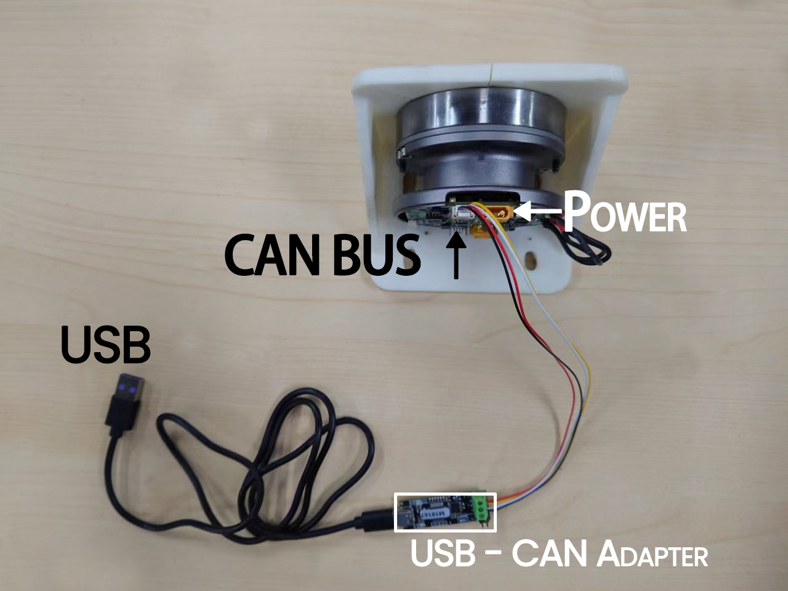

# README

### System Requirement

Ubuntu 22.04

Python >= 3.10

Internet Connection ( only for installation )

### Connect Mini Hub to your actuator



### Install dependencies

Install `net-tools` if not installed

```bash
sudo apt-get install net-tools
```

Install `can-utils` if not installed

```bash
 sudo apt-get install can-utils
```

### Initialize Mini Hub


When the device is plugged into your Ubuntu computer, its enumerated name might be different.

Find device name by

```bash
ls /dev | grep ACM
```

> ttyACM0

So you can initialize adapter with commands below.

```bash
sudo slcand -o -c -s8 /dev/ttyACM0 can0
sudo ifconfig can0 up
sudo ifconfig can0 txqueuelen 1000
```

Always check the device name before initialize.

### (Optional) Check out device

To check out if  the device is working, use `candump`


Use  candump

```bash
candump can0
```

You can see the messages flowing across the screen if everything works fine. 

### Download Actuator Tuning Tool

```bash
mkdir actuator_tuning_tool
cd actuator_tuning_tool
wget https://raw.githubusercontent.com/AmberSTR/amber-actuator-core/main/actuator_tuning_tool
```
for Raspberry Pi , download arm version
```bash
wget https://raw.githubusercontent.com/AmberSTR/amber-actuator-core/main/actuator_tuning_tool_arm
```
### Start server

Perhaps you need to enable administrator privileges

```
sudo chmod 777 ./actuator_tuning_tool 
nohup ./actuator_tuning_tool &
```

### Install Python Interface

If there is no pip, please install it first，If so, please proceed directly to the second step

```
sudo apt install python-pip
```

```
pip install amber-actuator
```

### Python Usage

#### Import Library

```python
import amber_actuator as a
```

#### Initialize actuator

With Actuator ID (empty IP address will be considered as "127.0.0.1")

```python
j = a.AmberActuator(1)
```

... or with Joint ID and IP address ( Works within a LAN Connection)

```python
j = a.AmberActuator(1,"192.168.1.2")
```

#### Set Actuator to Position Mode

```python
j.position_mode()
```

 It will return a boolean value, where it will be true if it is in position mode 

#### Set Actuator's target

And  it will rotate to it's target.

```python
j.position.target = 120
```

#### Get Actuator's position now

```
j.position.now
```

> 119.9921875

### Actuator Utility Tools

Utility script adapted for one-click backup and restoration of actuator parameters to JSON .

```bash
wget https://raw.githubusercontent.com/AmberSTR/amber_actuator_tools/main/backup.py
wget https://raw.githubusercontent.com/AmberSTR/amber_actuator_tools/main/restore.py
```


### Configurable parameter

| Main Category      | Detailed Category   | Permission | Is Float      |
| ------------------ | ------------------- | ---------- | ------------- |
| attribute          | Status              | get/set    |               |
|                    | version             | get        |               |
|                    | mode                | get/set    | FALSE         |
|                    | pole_number         | get/set    | FALSE         |
|                    | rotation_direction  | get/set    | FALSE         |
|                    | zero_position       | get/set    | TRUE          |
|                    | gear                | get/set    | FALSE         |
|                    | CountNumber         | get ONLY   | TRUE          |
| position           | now                 | get ONLY   | TRUE          |
|                    | target              | set ONLY   | TRUE          |
|                    | Kp                  | get/set    | TRUE          |
|                    | Ki                  | get/set    | TRUE          |
|                    | up_limit            | get/set    | TRUE          |
|                    | down_limit          | get/set    | TRUE          |
|                    | limit_switch        | get/set    | FALSE         |
| speed              | now                 | get ONLY   | FALSE (True)* |
|                    | target              | set ONLY   | TRUE          |
|                    | kp                  | get/set    | TRUE          |
|                    | ki                  | get/set    | TRUE          |
|                    | acceleration        | get/set    | TRUE          |
|                    | deceleration        | get/set    | TRUE          |
|                    | speed_limit         | get/set    | TRUE          |
| current            | now                 | get ONLY   | TRUE          |
|                    | target              | set ONLY   | TRUE          |
|                    | kp                  | get/set    | TRUE          |
|                    | ki                  | get/set    | TRUE          |
|                    | current_limit       | get/set    | TRUE          |
|                    | VotageLimit         | get/set    | TRUE          |
| Built-in  Commands | Save                | set ONLY   |               |
|                    | InitialZeroPosition | set ONLY   |               |
|                    | Calibrate           | set ONLY   |               |

\*Depend on Actuator Version

**Note: Run save() to save the parameters persistently. Otherwise, the parameters are temporarily saved and will be reset after a power outage.**

### Calibrate

*Updated at  V 0.1.0*

The calibrate() function will cause the actuator to give up maintaining its current position( or speed/current ), please pay attention to safety.

After executing the calibrate() function, please wait for about six seconds and query the `attribute.zero_position` again. If there is a slight change, it means the calibration has been successful.

```python
>>> import amber_actuator as a
>>> j = a.AmberActuator(1)
>>> j.attribute.zero_position
3623.0
>>> j.calibrate()
True
>>> j.attribute.zero_position
3620.875
>>> 
```


### Python Example

​     There are four main categories. You can modify the parameters by accessing the parameter objects under the actuator. 'get/set' indicates that you can both read and write the parameters, 'get only' indicates that you can only read the parameters, and 'set only' indicates that you can only write the parameters.

### Attribute

| Parameter       |              version               |
| :-------------- | :--------------------------------: |
| **Description** | Display the current version number |
| **Permission**  |                get                 |
| **Return**      |           version number           |

```
import amber_actuator as a

actuator = a.AmberActuator(1)

version=actuator.attribute.version

print(" version:", version)

```


| Parameter       |                mode                |      |
| :-------------- | :--------------------------------: | ---- |
| **Description** |        Query  in which mode        |      |
| **Permission**  |              get/set               |      |
| **Return**      | 0 : Motor shutdown;    fail :false |      |
|                 | 1 : Motor powered on;  fail :false |      |
|                 |  2 : Position mode;  fail :false   |      |
|                 |    3 : Speed mode; fail :false     |      |
|                 |   4 : Current mode;  fail :false   |      |
|                 |   5 : Moment mode;  fail :false    |      |

```
import amber_actuator as a

actuator = a.AmberActuator(1)

Before_mode=actuator.attribute.mode

print("Before mode:", Before_mode)

actuator.attribute.mode=0/1/2/3/4/5

now=actuator.attribute.mode

print("current_mode:", now)
```


| **Parameter**   |                  pole_number                  |
| :-------------- | :-------------------------------------------: |
| **Description** | Query the current number of pole of the motor |
| **Permission**  |                    get/set                    |
| **Is Float**    |                     False                     |
| **Return**      |                    number                     |

```
import amber_actuator as a

actuator = a.AmberActuator(1)

Before_mode=actuator.attribute.pole_number

print("Before pole_number:", Before_mode)

actuator.attribute.pole_number=your_value

now=actuator.attribute.pole_number

print("current pole_number:", now)
```


| Parameter       |                   rotation_direction                    |
| :-------------- | :-----------------------------------------------------: |
| **Description** |   Query the current rotation direction of the motor.    |
| **Permission**  |                         get/set                         |
| **Is Float**    |                          False                          |
| **Return**      | 1 : Counterclockwise is positive, clockwise is negative |
|                 | 0 : Clockwise is positive, counterclockwise is negative |

```
import amber_actuator as a

actuator = a.AmberActuator(1)

actuator.attribute.rotation_direction=0/1

now=actuator.attribute.rotation_direction

print("current_direction:", now)
```


| **Parameter**   |                zero_position                 |      |
| :-------------- | :------------------------------------------: | ---- |
| **Description** | Query the current zero position of the motor |      |
| **Permission**  |                   get/set                    |      |
| **Is Float**    |                     True                     |      |
| **Return**      |                    number                    |      |

```
import amber_actuator as a
import time

actuator = a.AmberActuator(1)

Before_value=actuator.attribute.zero_position

print("Before zero_position:", Before_value)

actuator.attribute.zero_position=your_value

time.sleep(3)

now=actuator.attribute.zero_position

print("current zero_position:", now)
```


| Parameter       |                      gear                      |      |
| :-------------- | :--------------------------------------------: | ---- |
| **Description** | Query the current number of gears of the motor |      |
| **Permission**  |                    get/set                     |      |
| **Is Float**    |                     False                      |      |
| **Return**      |                     number                     |      |

```
import amber_actuator as a

actuator = a.AmberActuator(1)

Before_mode=actuator.attribute.gear

print("Before gear:", Before_mode)

actuator.attribute.gear=your_value

now=actuator.attribute.gear

print("current_gear:", now)
```


### position

| parameter       |                  target                  |
| :-------------- | :--------------------------------------: |
| **Description** | Set the position parameter of the motor  |
| **Permission**  |                 set only                 |
| **Is Float**    |                   True                   |
| **Return**      | success: your_target         fail: false |

| parameter       |                        now                        |
| :-------------- | :-----------------------------------------------: |
| **Description** | Query the current position parameter of the motor |
| **Permission**  |                     get only                      |
| **Is Float**    |                       True                        |
| **Return**      |   success: Current position         fail: false   |

```
import amber_actuator as a
import time

actuator = a.AmberActuator(1)

actuator.position_mode()

Before_position=actuator.position.target

print("Before position:", Before_position)

actuator.position.target = your_target

print("your_target:", actuator.position.target)

time.sleep(4)

current_position = actuator.position.now

print("Current position:", current_position)
```

| **Parameter**   |                        kp / ki                        |
| :-------------- | :---------------------------------------------------: |
| **Description** | Set/get the position loop PID parameters of the motor |
| **Permission**  |                        get/set                        |
| **Is Float**    |                         True                          |
| **Return**      |       success: your_value           fail: false       |

```
import amber_actuator as a

actuator = a.AmberActuator(1)

Before_value=actuator.position.kp

print("Before position kp value:", Before_value)

actuator.position.kp=your_value

now=actuator.position.kp

print("Current position kp value:", now)
```

```
import amber_actuator as a

actuator = a.AmberActuator(1)

Before_value=actuator.position.ki

print("Before position ki value:", Before_value)

actuator.position.ki=your_value

now=actuator.position.ki

print("Current position ki value:", now)
```

| **Parameter**   |                   up_limit/down_limit                   |
| :-------------- | :-----------------------------------------------------: |
| **Description** | Query the value of the up limit/down limit of the motor |
| **Permission**  |                         get/set                         |
| **Is Float**    |                          True                           |
| **Return**      |       success: your_value           fail : false        |

```
import amber_actuator as a

actuator = a.AmberActuator(1)

actuator.position_mode()

Before_value=actuator.position.up_limit

print("Before position up_limit:", Before_value)

actuator.position.up_limit=your_value

now=actuator.position.up_limit

print("Current position up_limit:", now)
```


| **Parameter**   |             limit_switch              |
| :-------------- | :-----------------------------------: |
| **Description** | Check if the motor limit is turned on |
| **Permission**  |                get/set                |
| **Is Float**    |                 False                 |
| **Return**      |   0: Closed  1: open    fail :false   |

```
import amber_actuator as a

actuator = a.AmberActuator(1)

actuator.position_mode()

Before_value=actuator.position.limit_switch

print("Before position up_limit:", Before_value)

actuator.position.limit_switch=0/1

now=actuator.position.limit_switch

print("Current position limit_switch:", now)
```


### speed

| parameter       |                target                |
| :-------------- | :----------------------------------: |
| **Description** | Set the speed parameter of the motor |
| **Permission**  |               set only               |
| **Is Float**    |                 True                 |
| **Return**      |                                      |

| parameter       |                   now                    |
| :-------------- | :--------------------------------------: |
| **Description** |   Set the speed parameter of the motor   |
| **Permission**  |                 get only                 |
| **Is Float**    |                  False                   |
| **Return**      | success: your_target         fail: false |

```
import amber_actuator as a

actuator = a.AmberActuator(1)

actuator.speed_mode()

actuator.speed.target = your_target

while True:

	current_speed = actuator.speed.now

	print("Current speed:", current_speed)

```

| **Parameter**   |                       kp/ki                        |
| :-------------- | :------------------------------------------------: |
| **Description** | Set/get the speed loop PID parameters of the motor |
| **Permission**  |                      get/set                       |
| **Is Float**    |                        True                        |
| **Return**      |     success: your_value           fail: false      |

```
import amber_actuator as a

actuator = a.AmberActuator(1)

actuator.speed_mode()

Before_value=actuator.speed.kp

print("Before speed kp value:", Before_value)

actuator.speed.kp=your_value

now=actuator.speed.kp

print("Current speed kp value:", now)
```

```
import amber_actuator as a

actuator = a.AmberActuator(1)

actuator.speed_mode()

Before_value=actuator.speed.ki

print("Before speed ki value:", Before_value)

actuator.speed.ki=your_value

now=actuator.speed.ki

print("Current speed ki value:", now)
```

| **Parameter**   |                  acceleration/deceleration                   |
| :-------------- | :----------------------------------------------------------: |
| **Description** | Set/Get the acceleration/deceleration parameters of the motor |
| **Permission**  |                           get/set                            |
| **Is Float**    |                             True                             |
| **Return**      |          success: your_value           fail: false           |

```
import amber_actuator as a

actuator = a.AmberActuator(1)

actuator.speed_mode()

Before_value=actuator.speed.acceleration

print("Before speed acceleration:", Before_value)

actuator.speed.acceleration=your_value

now=actuator.speed.acceleration

print("Current speed speed acceleration:", now)
```

 If you want to set the value of deceleration, you just need to replace 'acceleration' with 'deceleration' in the code." 

| **Parameter**   |                speed_limit                |
| :-------------- | :---------------------------------------: |
| **Description** |       the  speed limit of the motor       |
| **Permission**  |                  get/set                  |
| **Is Float**    |                   True                    |
| **Return**      | success: your_value           fail: false |

```
import amber_actuator as a

actuator = a.AmberActuator(1)

actuator.speed_mode()

Before_value=actuator.speed.speed_limit

print("Before speed_limit:", Before_value)

actuator.speed_limit=your_value

now=actuator.speed_limit

print("Current speed speed_limit:", now)
```


### Current

| **Parameter**   |                  target                   |
| :-------------- | :---------------------------------------: |
| **Description** | Set the target current value of the motor |
| **Permission**  |                 set only                  |
| **Is Float**    |                   True                    |
| **Return**      |                                           |

| **Parameter**   |                     now                     |
| :-------------- | :-----------------------------------------: |
| **Description** | Query the target current value of the motor |
| **Permission**  |                  get only                   |
| **Is Float**    |                    True                     |
| **Return**      |  success: your_value           fail: false  |

```
import amber_actuator as a

actuator = a.AmberActuator(1)

actuator.current_mode()

actuator.current.target = 0

while True:

	current_value = actuator.current.now

	print("Current value:", current_value)
```

| **Parameter**   |                        kp/ki                         |
| :-------------- | :--------------------------------------------------: |
| **Description** | Set/get the current loop PID parameters of the motor |
| **Permission**  |                       get/set                        |
| **Is Float**    |                         True                         |
| **Return**      |      success: your_value           fail: false       |

```
import amber_actuator as a

actuator = a.AmberActuator(1)

actuator.current_mode()

Before_value=actuator.current.kp

print("Before current kp value:", Before_value)

actuator.current.kp=your_value

now=actuator.current.kp

print("Current current kp value:", now)
```

```
import amber_actuator as a

actuator = a.AmberActuator(1)

actuator.current_mode()

Before_value=actuator.current.ki

print("Before current ki value:", Before_value)

actuator.current.ki=your_value

now=actuator.current.ki

print("Current current ki value:", now)
```


| **Parameter**   |                current_limit                |
| :-------------- | :-----------------------------------------: |
| **Description** | Query  the current limit value of the motor |
| **Permission**  |                   get/set                   |
| **Is Float**    |                    True                     |
| **Return**      | success: your_value           fail : false  |

```
import amber_actuator as a

actuator = a.AmberActuator(1)

actuator.current_mode()

Before_value=actuator.speed.current_limit

print("Before current_limit:", Before_value)

actuator.current_limit=your_value

now=actuator.current_limit

print("Current current current_limit:", now)
```

